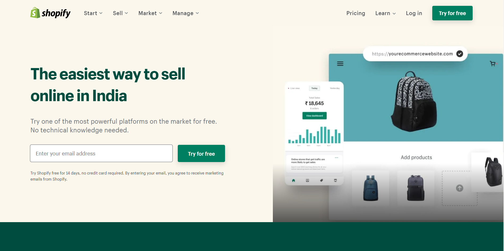

# Shopify Website Clone Project.

## **Project: Shopify Website UI Clone Project using Tailwind CSS.**

### Concepts learned from this project:
- Learned more about image responsiveness in Tailwind CSS.   
- The Entire project is builded using pure Tailwind CSS.

### Time taken to complete this project:
- It took more than 1 day to complete.
- Adding HTML Part took 3-5 hour.
- Tailwind css part and Responsive Design part took more than 6-8 hour.

**Live Link :** [Click Here](https://shopify-website.netlify.app/ "Deployed on Netlify")

>### Preview :

